#Following Ben's build using simulation

Series of packages named cpu-* are different parts/elements of building Bens Eater 8bit computer from scratch 

Overview is here:
https://eater.net/8bit

## 1. State persistence - D-latch/flipflop

I've started with watching some parts on timers/SR-latches/D-latches and flipflops

First I've built  a simple D-latch item:
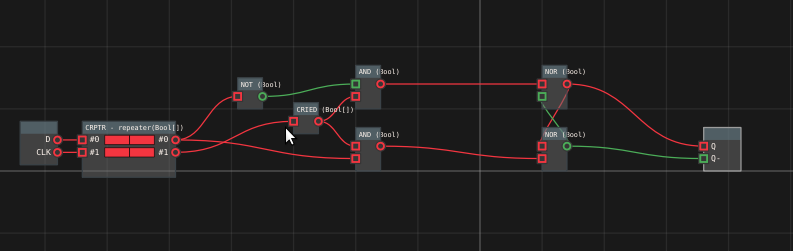

### Ben's Video:
[D-latch](https://www.youtube.com/watch?v=peCh_859q7Q)

[D-flipflop](https://www.youtube.com/watch?v=YW-_GkUguMM)

As far as I remember - no problems here.
Maybe one only - the circuit was somehow unstable until I used rising edge filter (chips/CRIED)

---
## 2. Registers - 1bit reg/8bit reg

Next I watched few more videos about registers and how they are connected to bus:

[Bus architecture and how register transfers work - 8 bit register - Part 1](https://www.youtube.com/watch?v=QzWW-CBugZo)

[Tri-state logic: Connecting multiple outputs together - 8 bit register - Part 2](https://www.youtube.com/watch?v=faAjse109Q8)

[Designing and building a 1-bit register - 8 bit register - Part 3](https://www.youtube.com/watch?v=-arYx_oVIj8)

Based mostly on the info from the last video - I've prepared a package with 1bit register:

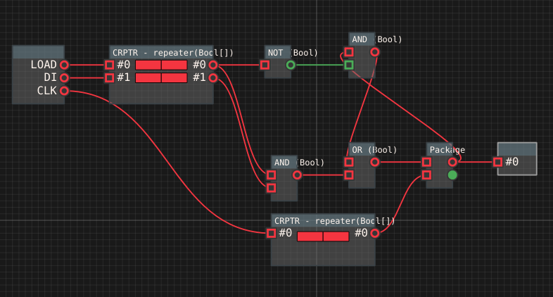

And then using next videos and omitting mostly all hardware stuff ...

[Building an 8-bit register - 8-bit register - Part 4](https://www.youtube.com/watch?v=CiMaWbz_6E8)
[Testing our computer's registers - 8-bit register - Part 5](https://www.youtube.com/watch?v=9WE3Obdjtv0&t=2s)

I've managed to build 8bit register just by multiplication of the 1bit one:

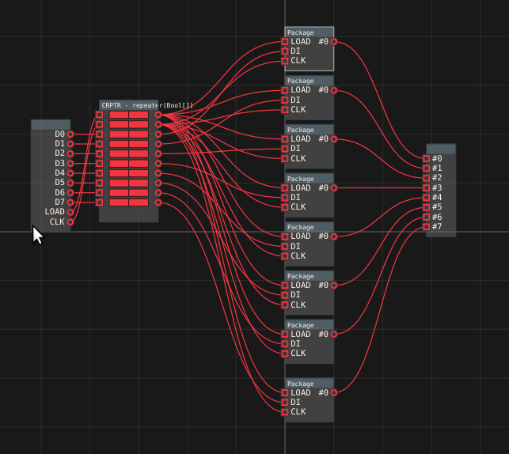

... and then build next one with "output enabler" made from few AND gates:

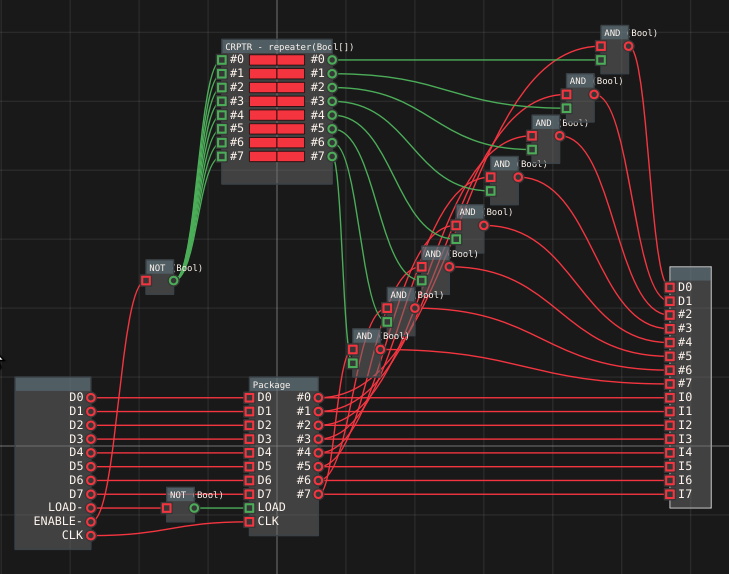

It has two sets of outputs:
- O0..O7 - controled by "ENABLE" input.
- I0..I7 - "internal" ones always active 

... and this was something I could play a little with - so I did building a messy test package:

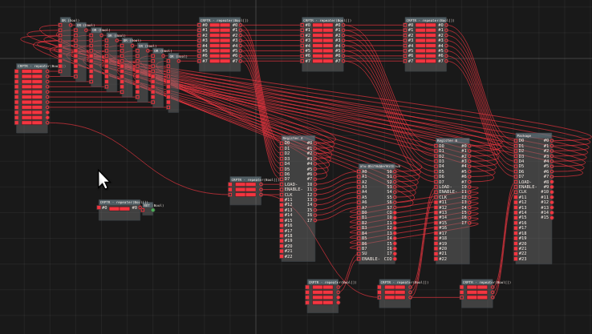

Of course there were some bugs which I located and eliminated using different methods like layout analysing, playing with lower level packages,debugging simulator, tracing to log etc 
Nice thing comparing to hardware is that You are "seeing" the signals - "on/true" is green "off/false" is red.
And You don't need any power source :)

On this package there are also some parts I've built later like ALU prototype. 
But generally Register A is just a package from previous part.
You can see also a strange construction on top which represent a bus.
The simulator has possibility only to connect single output to one or more inputs.
(You can read about things I would like to change [here](todo/base-concepts.md))
The only way to build a "bus" was then put the outputs through set of OR gates and use output of OR's as "bus output"
The side efect is (and difference from harware I think) that if  more than one register is enabled and outputs to bus - bus will contain a bitwise sum of signals.
As far as we are not puting more than one output to bus (and it shouldn't happen) the behavior of the solution should be same as in hardware.

Very usefull for me were also "repeaters" which I implemented (chips/CRPTR).
They are just forwarding the signal from input to output but You have also possibility to add (OR) true to the signal using button on left (astable) or button on right (stable).
It was usefull to simulate ticks (or event half-tics) of a clock, testing input of package/element etc.
Currently state of a repeater is serialized to package file - so one have to remember to keep it clean...

## 3. ALU

Based on info from videos here 

https://eater.net/8bit/alu

I've built 1bit Adder:

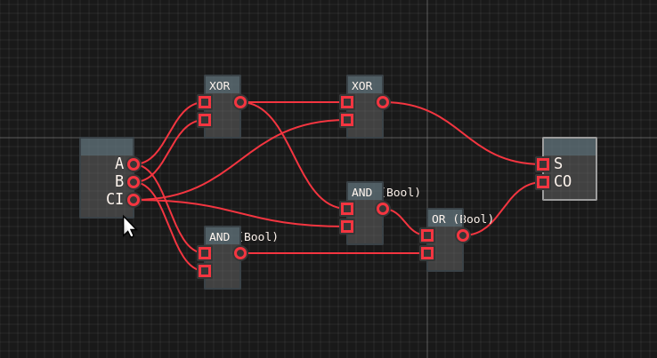

... then 4bit Adder - just by multiplication:

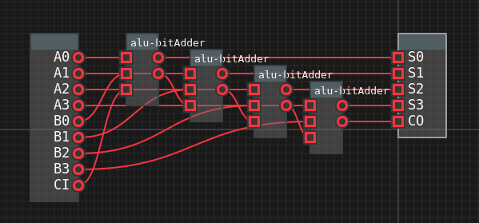

... and then 8bit Adder:

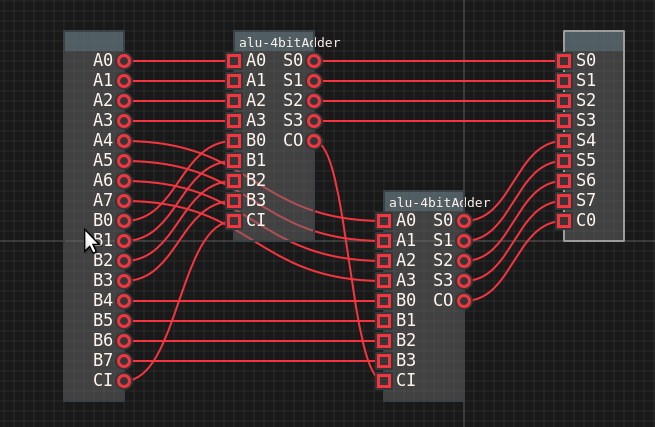

... 8bit Adder with subtraction:

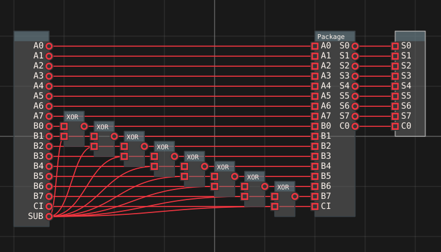

... 8bit Adder with subtraction and "output enabler" (namely complete "ALU" from Ben's tutorial):

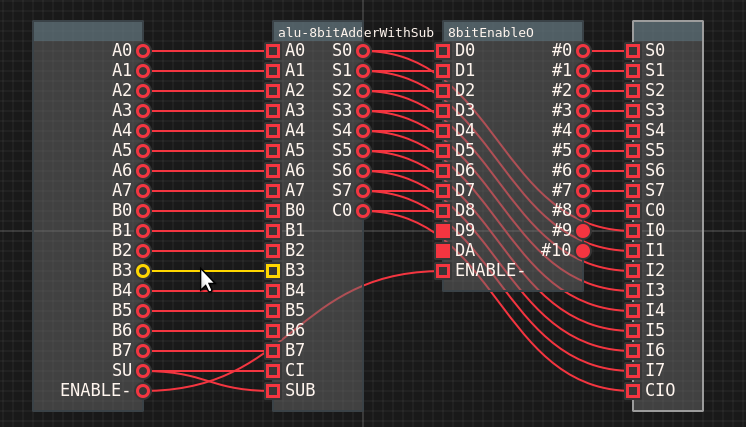

... and then packaged it with register A/B:

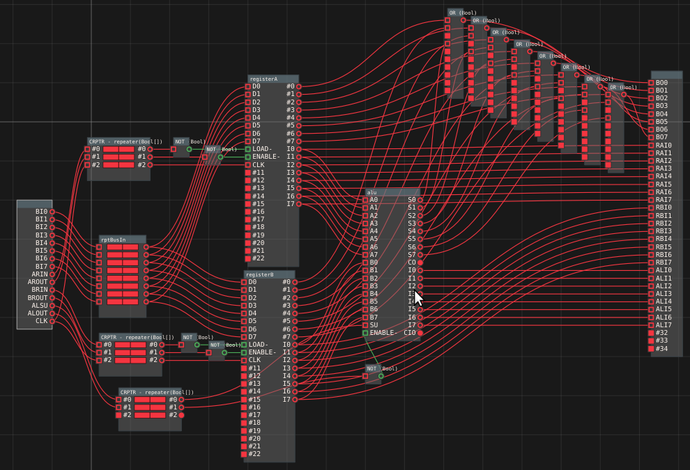

As You can see there is also kind of "internal bus" providing signal to main outputs
  BO0..BO7 depending of control states:
  - "AROUT" (register A to Output),
  - "BROUT" (register B to Output),
  - and "ALOUT" (ALU to Output)
  
Thanks to this - I had ALU/A/B in one package which was quite usefull.
And also for debug/monitoring  purposes - outputs RAI.., RBI.. and ALI..

## 4. RAM

Ben is talking about RAM here:

[https://eater.net/8bit/ram](https://eater.net/8bit/ram)

First I did few selectors...

1bit selector:

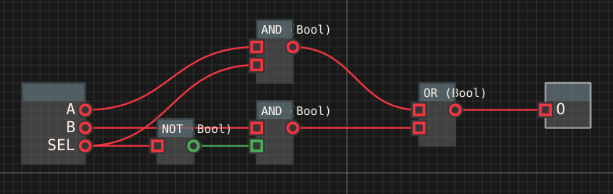

4bit selector:

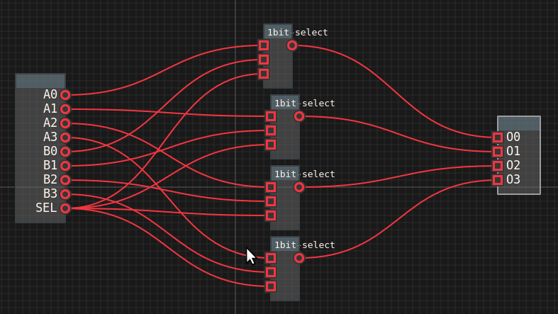

... and then packaged RAM with program mode using two registers, address/data selectors and custom chip with storage (chips/CRAM):

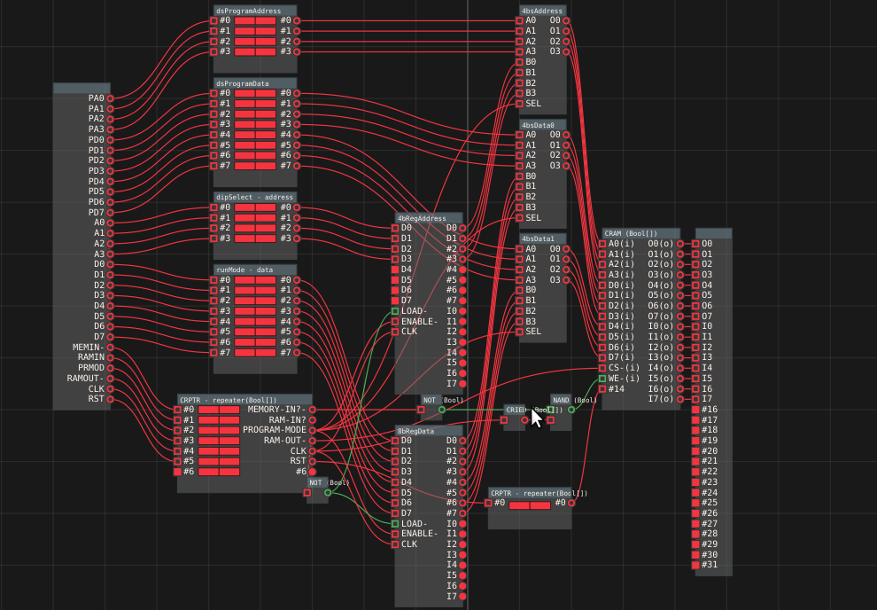

Now it was not far to the end ... 

The only things to be done yet were PC (Program Counter) and CL (Control Logic) - so I've get on it ...

## 5. Program Counter and Control Logic

.. and after watching few more videos from Ben:

[https://eater.net/8bit/pc](https://eater.net/8bit/pc)
[https://eater.net/8bit/bus](https://eater.net/8bit/bus)
[https://eater.net/8bit/control](https://eater.net/8bit/control)

... prepared this:

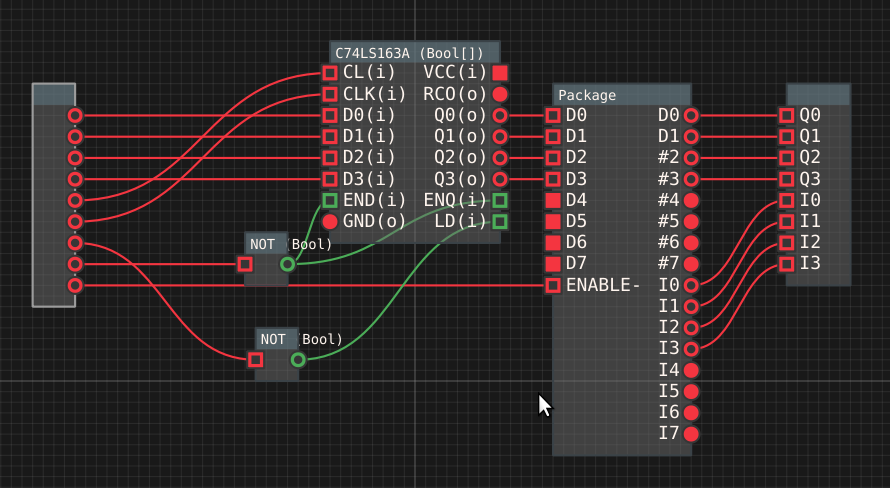

... and finally this:

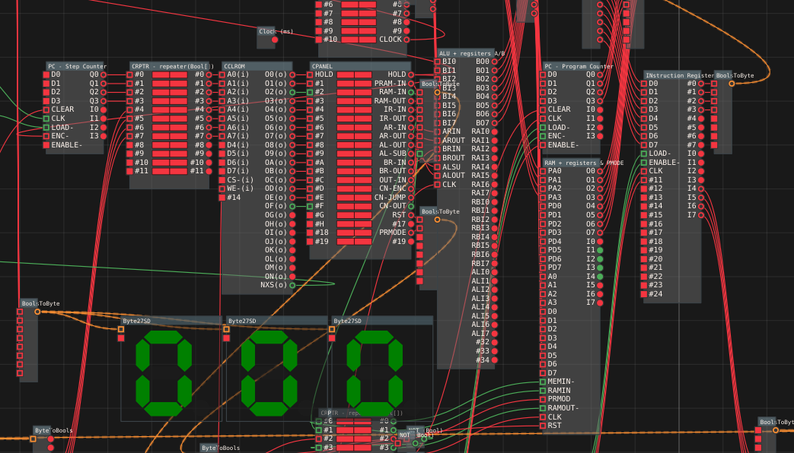

The last one is a complete 8bit computer from Ben (without output registers part which I haven't bother and just connected 7 seg display to bus)

Central here is CPANEL or manual control panel - in fact - just repeater (CRPTR)

ROM(CCLROM element) is initialised with simple instruction set (LDA/ADD/SUB/HLT - prepared as text representation of signals - CCLROM.h) 

and RAM(CRAM.cc) on reset is initialised with sample program:

```
    if (rst){
        //read program on reset
        //           LDA 14
        content[0]=0b00011110;
        //           ADD 15
        content[1]=0b00101111;
        //           SUB 8
        content[2]=0b00111000;
        //           HLT
        content[3]=0b01010000;
        //           NOP
        content[4]=0b00000000;
        // data
        content[8]=0b00000010;
       content[14]=0b00011100;
       content[15]=0b00001110;
    }
```

To start the program it is enough to set reset state (stable button in CPANEL left to "RST" signal) and click the clock several times ("CLK" signal above the CPANEL).

Normal "clicking" clock is not connected by default so one have to click the clock manually or connect it to repeater and put RST signal to "off"

You can watch the program run on the video:

[https://www.youtube.com/watch?v=0pVYmsPT2KQ](https://www.youtube.com/watch?v=0pVYmsPT2KQ)
