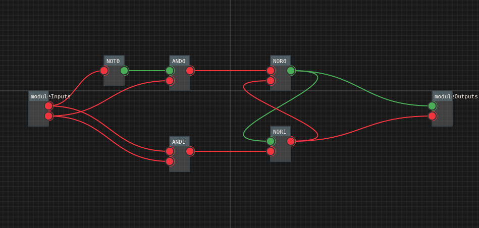

# Following Ben's build using simulation on q3sim

q3sim will be available in final form when it's implementation will be more complete

Currently there is available development version run as 

q3/q3/boostrap/boot.py (have to build some packages before - ie q3/q3c/build.sh)

Series of packages named cpu-* are different parts/elements of building Bens Eater 8bit computer from scratch 

Overview is here:
https://eater.net/8bit

## 1. State persistence - D-latch/flipflop

First I've built  a simple D-latch item:

[source](../q3/q3/bootstrap/tests/benSAP1/cpu-D-latch.py)